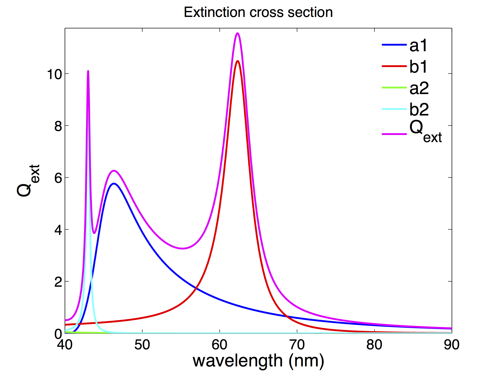
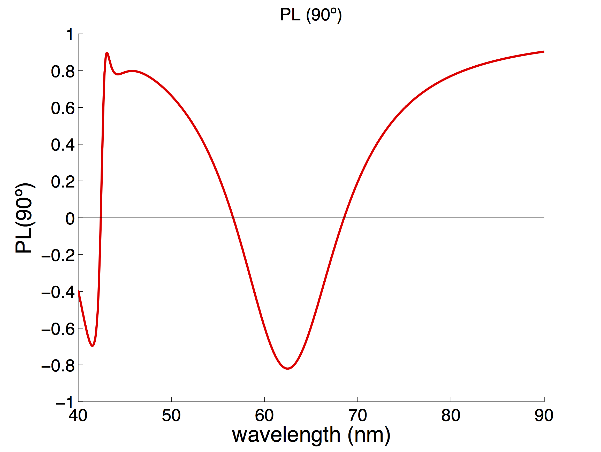

**By Yael Gutiérrez at Institute of Nanotechnology, CNR-NANOTEC, via Orabona 4, 70126 Bari, Italy.**

# Mie Theory 

### 1. Light scattering and light absorption by a Sphere
Mie’s Theory provides a way to calculate analytically the field scattered and absorbed by spheres of arbitrary radius, *a*, and refractive index, *N*. By expanding the incident electromagnetic wave into spherical harmonics, Gustav Mie was able to solve the Maxwell equations for this kind of geometry taking into account the boundary condition between the sphere and the medium that surrounds it.
The solutions of the absorbed and scattered fields are developed into vector spherical harmonics. Both solutions depend on different coeffients which are called Mie coeffients. On the one hand, there are the scattering coefficients which are usually denoted as *a_n* and *b_n*. On the other hand, there are the coefficients related to the  field inside the sphere, *c_n* and *d_n*. 
 
The scattering (*Q_sca*) and extinction cross-sections (*Q_ext*) of a sphere can be expressed in terms of the Mie scattering coefficients as

Re(a_n%2Bb_n))

(\mid\a_n\mid^2%2B\mid\b_n\mid^2))

Due to energy conservation, the extinguished radiation may be equal to the sum of the scattered and absorbed radiation. As a result of this, it is possible to give an expression for the absorption efficiency, *Q_abs*.


 
### 2. What do the **Mie-theory-for-a-sphere** does?
 
**Mie-theory-for-a-sphere** calculates:
- Absorption, Scattering and Extinction cross-sections .
- Electric and magnetic dipolar and quadrupolar contributions to the cross-sections (*a_1* dipolar electric, *b_1* dipolar magnetic, *a_2* quadrupolar electric and *b_2* quadrupolar magnetic).
- Linear polarization degree at rigth angle (*PL(90)*).

### 3. How does the code work?
There are two main functions:
- [**eficiencia.m**](https://github.com/yael1991/Mie-theory-for-a-sphere/blob/master/eficiencia.m) calculates the absorption, scattering and extinction efficiencies along with the 
dipolar electric, dipolar magnetic, quadrupolar electric and quadrupolar magnetic.
To run it just run the following line:
```
[Q, a1, a2, b1, b2] = eficiencia(indices, lambdas, nmax ,a)
```
 *  **lambdas**: is a vector of wavelengths for which the calculations will be computed.
 *  **indices**: is a vector containing the complex refractive index of the sphere for the wavelenghts contained in **lambdas**.
 *  **nmax**: is the maximum multipolar order to include in the calculation.
 *  **a**: sphere radius.

 
 
- [**PL90.m**](https://github.com/yael1991/Mie-theory-for-a-sphere/blob/master/PL90.m) calculates the linear polarization degree at rigth angle. This magnitude is defined as
  =\frac{I_s(90^{o})-Ip(90^{o})}{I_s(90^{o})+Ip(90^{o})})


 
